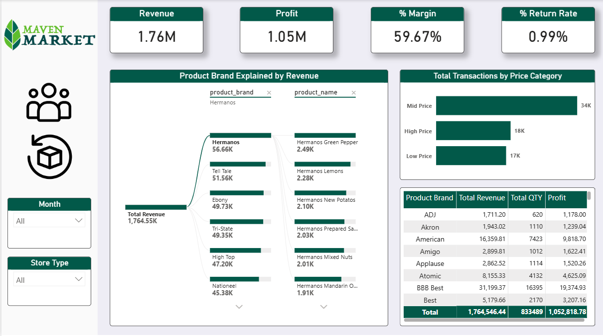
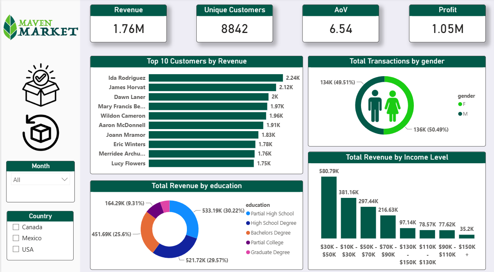

# market-retail-dashboard
##  Project Overview
An interactive, end-to-end Power BI dashboard analyzing retail store operations, customer sales trends, product performance, and return rate drivers to support data-driven business decisions.

##  Key Features & Insights
* **Executive Summary:** Overview of total revenue, profit margins, and sales targets.
* **Product Analytics:** Categorizing items by price tiers using custom DAX logic to identify best-selling products.
* **Customer Insights:** Demographics and purchasing behavior analysis.
* **Return Analysis:** Deep dive into product returns across brands, categories, and regions to minimize losses.

##  Tools & Technologies Used
* **Power BI Desktop**
* **DAX (Data Analysis Expressions)**
* **Power Query** (Data Cleaning & Transformation)

---

##  Dashboard Screenshots

### 1. Home Page

### 2. Executive Overview

### 3. Products Analysis

### 4. Customers Analysis

### 5. Returns Analysis

## Project Files
-  **[Download / View Excel Workbook](Maven%20Market%20Retail%20Dashboard.pbix)** *(Full interactive dashboard)*

